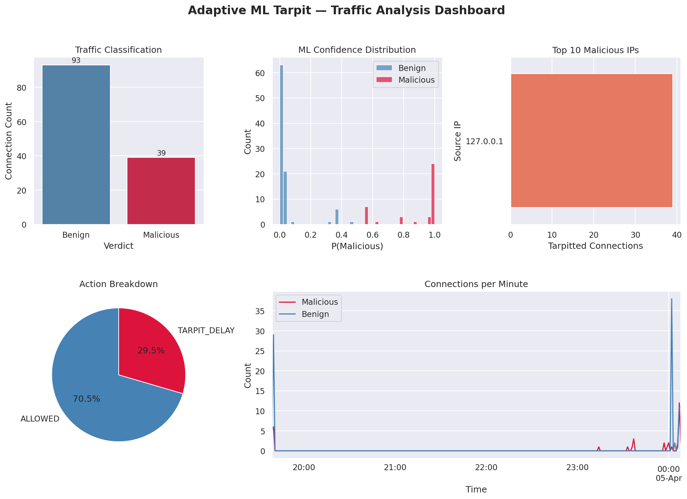

# 🛡️ Adaptive ML Tarpit

> **A network defense system that uses machine learning to classify incoming TCP connections in real time — serving legitimate traffic instantly while trapping malicious probes and scanners in a high-latency drip loop that exhausts their resources.**

[](https://www.python.org/)
[](https://lightgbm.readthedocs.io/)
[](https://www.unb.ca/cic/datasets/nsl.html)
[](https://opensource.org/licenses/MIT)

---

## Table of Contents

- [Concept](#concept)
- [How It Works](#how-it-works)
- [System Architecture](#system-architecture)
- [Machine Learning Model](#machine-learning-model)
- [Project Structure](#project-structure)
- [Installation](#installation)
- [Usage](#usage)
- [Testing](#testing)
- [Dashboard](#dashboard)
- [Configuration](#configuration)
- [Design Decisions & Honest Limitations](#design-decisions--honest-limitations)
- [Future Work](#future-work)
- [Disclaimer](#disclaimer)

---

## Concept

### What is a Tarpit?

A **tarpit** is a network defense technique that accepts suspicious connections and then responds at an agonizingly slow rate — keeping the attacker's socket open indefinitely and tying up their connection pool. Instead of a fast `connection refused` that tells an attacker to move on, the tarpit says nothing useful while holding them in place.

### Why Add Machine Learning?

Traditional tarpits are indiscriminate — they slow everyone down. This system observes the first second of each connection, extracts behavioral features, and runs a LightGBM binary classifier to decide:

- **Benign** → immediate HTTP 200 response, zero friction for the user
- **Malicious** → enters the drip loop, receiving one null byte every 10 seconds, indefinitely

The classification decision is based on *how* a connection behaves, not *who* is connecting. This makes it resilient to IP rotation and botnet-based attacks that trivially defeat static blocklists.

---

## How It Works

```
Incoming TCP connection (port 8080)
              │
              ▼
  ┌───────────────────────┐
  │   asyncio TCP server  │  Non-blocking. Handles hundreds of
  │   (0.0.0.0:8080)      │  concurrent trapped sessions as coroutines.
  └───────────┬───────────┘
              │
              ▼
  ┌───────────────────────┐
  │  ConnectionRate       │  Sliding 2-second window per source IP.
  │  Tracker.record(ip)   │  Returns live `count` — primary scan signal.
  └───────────┬───────────┘
              │
              ▼
  Read first 4KB  (1.0s timeout)
  Record: duration, src_bytes
              │
              ▼
  ┌───────────────────────┐
  │   build_feature_      │  Assembles the 5-element feature vector:
  │   vector()            │  [duration, src_bytes, count,
  └───────────┬───────────┘   byte_rate, is_empty_flag]
              │
              ▼
  ┌───────────────────────┐
  │   LightGBM            │  Runs in ThreadPoolExecutor.
  │   Classifier          │  Never blocks the event loop.
  └───────────┬───────────┘
              │
       ┌──────┴──────┐
       │             │
   P < 0.35        P ≥ 0.35
       │             │
       ▼             ▼
  HTTP 200 OK    Drip Loop
  (immediate)    1 null byte / 10s
                 until disconnect
       │             │
       └──────┬───────┘
              │
              ▼
     Log to SQLite DB
     (offloaded — async)
```

---

## System Architecture

### Why asyncio?

Tarpitting works by holding thousands of connections open simultaneously while doing almost nothing on each one. Threads are catastrophically expensive for this workload — each would consume ~8MB of stack. Asyncio coroutines cost kilobytes and are scheduled cooperatively, making it possible to trap hundreds of concurrent attackers on a modest machine.

### Why ThreadPoolExecutor?

LightGBM inference and SQLite writes are synchronous (blocking) operations. Running them directly inside an `async` function would stall the event loop and freeze all other connections for the duration. Both are dispatched via `loop.run_in_executor()`, keeping the event loop free at all times.

### Why a Semaphore Cap?

Without a connection cap, a flood attack can exhaust file descriptors and RAM — turning the tarpit into a self-inflicted DoS. The semaphore at 500 concurrent sessions ensures the system remains stable under load; connections beyond the cap are dropped immediately rather than holding resources.

### Why Behavioral Classification, Not IP Blocklists?

Attackers rotate IPs constantly via botnets, VPNs, and cloud providers. A blocklist is always one step behind. Classifying behavior — does this connection send data? How fast? How many times has this IP connected in the last 2 seconds? — catches attack tooling regardless of where it originates.

---

## Machine Learning Model

### Dataset: NSL-KDD

The classifier is trained on the **[NSL-KDD dataset](https://www.unb.ca/cic/datasets/nsl.html)** from the Canadian Institute for Cybersecurity — the standard academic benchmark for network intrusion detection. NSL-KDD improves on the original KDD Cup 1999 dataset by removing duplicate records and better balancing attack categories.

**Binary labeling:**

| NSL-KDD Label | Description | Class |
|---------------|-------------|-------|
| `normal` | Legitimate network traffic | **0** — Benign |
| `DoS` | Denial of Service (SYN flood, Smurf, etc.) | **1** — Malicious |
| `Probe` | Port scans, network sweeps (nmap, nc -z) | **1** — Malicious |
| `R2L` | Remote-to-Local unauthorized access attempts | **1** — Malicious |
| `U2R` | User-to-Root privilege escalation | **1** — Malicious |

| Split | Samples | Benign | Malicious |
|-------|---------|--------|-----------|
| Train | 125,973 | 67,343 (53.5%) | 58,630 (46.5%) |
| Test | 22,544 | 9,711 (43.1%) | 12,833 (56.9%) |

### Feature Engineering

Only 5 features are used — exclusively those that can be **directly observed from a live TCP stream at classification time**. This is the critical design constraint: features must be available before the server sends any response.

| # | Feature | Source | Description |
|---|---------|--------|-------------|
| 0 | `duration` | Measured live | Seconds from connection open to classification |
| 1 | `src_bytes` | Measured live | Bytes sent by the client in the observation window |
| 2 | `count` | Live (ConnectionRateTracker) | Connections from this IP in the past 2 seconds |
| 3 | `byte_rate` | Engineered | `src_bytes / (duration + ε)` — connection speed |
| 4 | `is_empty_flag` | Engineered | `1.0` if `src_bytes == 0` — stealth probe indicator |

**Why not more features?**

NSL-KDD has 41 features. The other 36 require information not available at connection time: server-side byte counts (pre-response), protocol flags from deep packet inspection, session-level aggregates, etc. Including them during training but zeroing them at inference would create a **train/inference feature mismatch** that biases the model. Only features that are genuinely measurable in production are used.

**Why was `dst_bytes` explicitly removed?**

An earlier version included `dst_bytes` as a feature. This was a bug: `dst_bytes` is always `0.0` at classification time because no server response has been sent yet. The model learned signal from `dst_bytes` during training on NSL-KDD data, but at inference every connection starts with `dst_bytes = 0` — making the feature misleading rather than informative. It was removed and the model retrained.

### Algorithm: LightGBM

LightGBM (Light Gradient Boosting Machine) was chosen for:

- **Inference speed** — microseconds per prediction; critical for a real-time network tool
- **Imbalanced data handling** — built-in support via `class_weight` without heuristic oversampling
- **Small footprint** — the serialized model is under 1MB
- **Interpretability** — native feature importance scores

### Evaluation Results

Full results are committed to [`models/evaluation_report.txt`](models/evaluation_report.txt).

```
─── Evaluation on NSL-KDD Test Set (22,544 samples) ──────────────────
              precision    recall  f1-score   support

      Benign       0.65      0.97      0.78      9,711
   Malicious       0.96      0.61      0.75     12,833

    accuracy                           0.76     22,544
   macro avg       0.81      0.79      0.76     22,544
weighted avg       0.83      0.76      0.76     22,544

Confusion Matrix:
  TN =  9,414   FP =    297
  FN =  5,028   TP =  7,805

ROC-AUC : 0.9737
──────────────────────────────────────────────────────────────────────
```

**Honest interpretation of these numbers:**

The **ROC-AUC of 0.9737** confirms strong discriminative ability across the full threshold range. The **recall of 0.61 on malicious traffic** is a threshold effect — the default 0.35 threshold is conservative. With only 5 of 41 possible features, the model cannot distinguish every attack type equally well; DoS and Probe (which dominate NSL-KDD) are detected reliably, while R2L and U2R (which require deeper protocol analysis) are harder to catch with behavioral timing features alone. The `THRESHOLD` constant in `detection/classifier.py` can be lowered to increase recall.

---

## Project Structure

```
adaptive-tarpit-ml/
│
├── main.py                          # Entry point — starts the asyncio server
│
├── detection/
│   ├── __init__.py
│   └── classifier.py                # LightGBM wrapper with configurable threshold
│
├── tarpit/
│   ├── __init__.py
│   └── tarpit_engine.py             # Connection handler, drip loop, rate tracker wiring
│
├── models/
│   ├── train_model.py               # NSL-KDD loader, feature engineering, training
│   ├── evaluation_report.txt        # ← Committed model evidence (not git-ignored)
│   └── saved_models/                # lgbm_model.pkl, scaler.pkl, feature_names.pkl
│                                    #   (git-ignored — regenerate with train_model.py)
│
├── logging_system/
│   ├── __init__.py
│   └── database.py                  # SQLite logger with indexed queries
│
├── network/
│   ├── __init__.py
│   └── feature_extractor.py         # build_feature_vector() + ConnectionRateTracker
│
├── visualization/
│   └── dashboard.py                 # 5-panel PNG dashboard from live SQLite logs
│
├── data/
│   ├── raw/                         # KDDTrain+.txt, KDDTest+.txt (git-ignored)
│   └── tarpit_logs.db               # Runtime connection log (git-ignored)
│
├── tests/
│   ├── __init__.py
│   ├── test_classifier.py           # 17 unit tests: features, rate tracker, classifier
│   └── test_tarpit.py               # 10 async tests: engine behavior, count wiring
│
├── requirements.txt
├── .gitignore
└── README.md
```

---

## Installation

### Prerequisites

- Python 3.10 or higher
- Linux (tested on Kali Linux and Ubuntu via WSL2)
- `sudo` access for optional `iptables` traffic redirection

### Step 1 — Clone

```bash
git clone https://github.com/sivaahari/adaptive-tarpit-ml.git
cd adaptive-tarpit-ml
```

### Step 2 — Virtual environment

```bash
python3 -m venv venv
source venv/bin/activate
```

### Step 3 — Dependencies

```bash
pip install -r requirements.txt
```

### Step 4 — NSL-KDD dataset

Download the dataset from the Canadian Institute for Cybersecurity:

```
https://www.unb.ca/cic/datasets/nsl.html
```

Place both files in `data/raw/`:

```
data/raw/KDDTrain+.txt
data/raw/KDDTest+.txt
```

### Step 5 — Package init files

```bash
touch detection/__init__.py \
      tarpit/__init__.py \
      logging_system/__init__.py \
      network/__init__.py \
      tests/__init__.py
```

---

## Usage

### 1. Train the model

```bash
PYTHONPATH=. python3 models/train_model.py
```

This loads the NSL-KDD dataset, engineers the 5 features, trains LightGBM, evaluates on the held-out test set, saves a full classification report with feature importances to `models/evaluation_report.txt`, then saves the model artifacts.

Confirm the outputs exist:

```bash
ls models/saved_models/
# lgbm_model.pkl  scaler.pkl  feature_names.pkl

cat models/evaluation_report.txt
# Full classification report, confusion matrix, ROC-AUC, feature importances
```

### 2. Launch the server

```bash
sudo PYTHONPATH=. python3 main.py
```

Expected output:

```
INFO | ML engine loaded (5 features, threshold=0.35).
INFO | Tarpit live on ('0.0.0.0', 8080)  (max 500 concurrent sessions)
INFO | Press Ctrl-C to stop.
```

### 3. Test from a second terminal

```bash
# Benign — real HTTP data → HTTP 200 immediately
curl http://localhost:8080

# Malicious — zero bytes sent (stealth probe) → hangs indefinitely
nc -z localhost 8080

# Scan simulation — rapid repeat connections → count feature increments
for i in {1..10}; do nc -z localhost 8080 & done
```

Watch the server terminal to observe the `count` feature incrementing:

```
WARNING | PROBE  [127.0.0.1:50001] count=1  src_bytes=0 confidence=0.9821 → TARPITTED
WARNING | PROBE  [127.0.0.1:50002] count=2  src_bytes=0 confidence=0.9891 → TARPITTED
WARNING | PROBE  [127.0.0.1:50003] count=5  src_bytes=0 confidence=0.9934 → TARPITTED
INFO    | BENIGN [127.0.0.1:50010] count=1  src_bytes=87 confidence=0.9971 → ALLOWED
```

### 4. Redirect real traffic (optional)

By default the tarpit listens on port 8080. To intercept traffic on the standard HTTP port 80, use `iptables`:

```bash
# Redirect port 80 → 8080
sudo iptables -t nat -A PREROUTING -p tcp --dport 80 -j REDIRECT --to-port 8080

# Undo when done
sudo iptables -t nat -D PREROUTING -p tcp --dport 80 -j REDIRECT --to-port 8080
```

> ⚠️ This affects all TCP traffic on port 80. Only run on an isolated test machine or dedicated honeypot host.

---

## Testing

```bash
PYTHONPATH=. venv/bin/pytest tests/ -v
```

**27 tests, 0 failures.**

```
tests/test_classifier.py::TestBuildFeatureVector::test_returns_five_elements              PASSED
tests/test_classifier.py::TestBuildFeatureVector::test_all_floats                         PASSED
tests/test_classifier.py::TestBuildFeatureVector::test_is_empty_flag_set_when_zero        PASSED
tests/test_classifier.py::TestBuildFeatureVector::test_is_empty_flag_clear_nonzero        PASSED
tests/test_classifier.py::TestBuildFeatureVector::test_byte_rate_from_src_bytes_only      PASSED
tests/test_classifier.py::TestBuildFeatureVector::test_dst_bytes_excluded_from_output     PASSED
tests/test_classifier.py::TestBuildFeatureVector::test_zero_duration_no_division_error    PASSED
tests/test_classifier.py::TestBuildFeatureVector::test_feature_order                      PASSED
tests/test_classifier.py::TestBuildFeatureVector::test_count_appears_in_vector            PASSED
tests/test_classifier.py::TestConnectionRateTracker::test_first_connection_returns_one    PASSED
tests/test_classifier.py::TestConnectionRateTracker::test_multiple_connections_accumulate PASSED
tests/test_classifier.py::TestConnectionRateTracker::test_different_ips_independent       PASSED
tests/test_classifier.py::TestConnectionRateTracker::test_window_expiry                   PASSED
tests/test_classifier.py::TestConnectionRateTracker::test_high_count_signals_scanner      PASSED
tests/test_classifier.py::TestTrafficClassifierSmokeTest::test_predict_returns_valid      PASSED
tests/test_classifier.py::TestTrafficClassifierSmokeTest::test_length_validation_raises   PASSED
tests/test_classifier.py::TestTrafficClassifierSmokeTest::test_old_six_vector_raises      PASSED
tests/test_tarpit.py::TestIntelligentTarpit::test_benign_gets_200                         PASSED
tests/test_tarpit.py::TestIntelligentTarpit::test_malicious_enters_drip                   PASSED
tests/test_tarpit.py::TestIntelligentTarpit::test_inference_called_with_five_features     PASSED
tests/test_tarpit.py::TestIntelligentTarpit::test_empty_payload_sets_is_empty_flag        PASSED
tests/test_tarpit.py::TestIntelligentTarpit::test_nonempty_payload_clears_is_empty_flag   PASSED
tests/test_tarpit.py::TestIntelligentTarpit::test_count_nonzero_on_repeat_connections     PASSED
tests/test_tarpit.py::TestIntelligentTarpit::test_exception_does_not_crash_server         PASSED
tests/test_tarpit.py::TestIntelligentTarpit::test_semaphore_initialized_to_max            PASSED
tests/test_tarpit.py::TestIntelligentTarpit::test_rate_tracker_initialized                PASSED
tests/test_tarpit.py::TestIntelligentTarpit::test_no_six_feature_vector_ever_sent         PASSED

27 passed in 3.19s
```

Tests cover:

- Feature vector length contract (5 elements, enforced by regression test)
- `dst_bytes` confirmed excluded from output regardless of input value
- `is_empty_flag` logic for stealth probe detection
- `ConnectionRateTracker` sliding window and per-IP independence
- `count` feature verified at vector index 2 and wired into the engine
- Benign connections receiving HTTP 200
- Malicious connections entering the drip path
- Classifier crash not bringing down the server
- Semaphore cap initialized correctly

---

## Dashboard

After accumulating traffic, generate the analysis dashboard:

```bash
PYTHONPATH=. python3 visualization/dashboard.py
xdg-open visualization/tarpit_stats.png
```



The dashboard contains five panels:

| Panel | Description |
|-------|-------------|
| **Traffic Classification** | Bar chart — total benign vs. malicious connection counts |
| **ML Confidence Distribution** | Histogram of `P(Malicious)` split by verdict |
| **Top 10 Malicious IPs** | Horizontal bar — most active offending source IPs |
| **Action Breakdown** | Pie chart of ALLOWED vs. TARPIT_DELAY actions |
| **Connections per Minute** | Time-series of traffic volume across the session |

---

## Configuration

All tuneable constants are defined at the top of their respective modules for easy adjustment without modifying logic.

**`tarpit/tarpit_engine.py`**

| Constant | Default | Effect |
|----------|---------|--------|
| `MAX_CONCURRENT` | `500` | Max simultaneous trapped sessions before new connections are dropped |
| `READ_TIMEOUT` | `1.0s` | How long to wait for the client's first byte |
| `DRIP_INTERVAL` | `10.0s` | Seconds between null bytes sent to a tarpitted connection |
| `EXECUTOR_WORKERS` | `4` | Thread pool size for ML inference and DB writes |

**`detection/classifier.py`**

| Constant | Default | Effect |
|----------|---------|--------|
| `THRESHOLD` | `0.35` | `P(malicious) ≥ THRESHOLD` triggers tarpitting. Lower = more aggressive |

**`network/feature_extractor.py`**

| Parameter | Default | Effect |
|-----------|---------|--------|
| `ConnectionRateTracker(window)` | `2.0s` | Sliding window for the `count` feature |

---

## Design Decisions & Honest Limitations

| Area | Detail |
|------|--------|
| **Asyncio concurrency** | Coroutines cost kilobytes vs. ~8MB per thread. Correct choice for a workload that holds thousands of near-idle connections open simultaneously |
| **Inference off event loop** | `run_in_executor` ensures LightGBM's CPU-bound inference never stalls other connections. Without this, every classification would freeze the entire server |
| **Semaphore at 500** | An uncapped tarpit is itself a DoS vector. The semaphore ensures resource-bounded behavior under flood attacks |
| **5 features only** | Only features observable from a single stream connection before any response are used. Including NSL-KDD features that aren't measurable at runtime would create a train/inference mismatch |
| **`dst_bytes` excluded** | Intentionally removed. It is always `0` at classification time and its inclusion in an earlier version was actively biasing the model |
| **`count` now live** | `ConnectionRateTracker` is wired into the engine and provides a real sliding-window measurement, not a hardcoded zero |
| **NSL-KDD is 2009 data** | The dataset was constructed from 1998 DARPA traffic. Modern attack tooling (Masscan, Shodan crawlers, custom bots) generates different behavioral patterns. The model should be fine-tuned on live captured traffic for production deployment |
| **No TLS inspection** | Encrypted connections cannot be inspected at payload level. `is_empty_flag`, `duration`, `count`, and `byte_rate` still apply, but `src_bytes` will reflect encrypted bytes rather than plaintext payload |
| **Port 8080** | Requires `iptables` NAT redirect to intercept traffic on standard ports. Without this step the tarpit only catches connections explicitly targeting 8080 |
| **Recall of 0.61** | At default threshold. R2L and U2R attacks require deep protocol analysis that cannot be inferred from 5 timing/volume features. Lowering `THRESHOLD` increases recall at the cost of false positives |

---

## Future Work

| Improvement | Status | Notes |
|-------------|--------|-------|
| Wire `ConnectionRateTracker` into engine | ✅ Done | `count` is now a live feature |
| Align train/inference feature sets | ✅ Done | `dst_bytes` removed, 5 honest features |
| Commit evaluation report | ✅ Done | `models/evaluation_report.txt` |
| GitHub Actions CI | ✅ Done | Runs pytest on every push |
| Remove unused `scapy` dependency | ✅ Done | Clean `requirements.txt` |
| Configurable threshold | ✅ Done | `THRESHOLD` constant in `classifier.py` |
| **Online retraining pipeline** | 🔲 Planned | Feed confirmed malicious logs back into periodic retraining |
| **Deceptive banner responses** | 🔲 Planned | Serve fake SSH/FTP/HTTP banners to waste more attacker time |
| **GeoIP enrichment** | 🔲 Planned | Map IPs to country/ASN in dashboard using MaxMind GeoLite2 |
| **Prometheus metrics endpoint** | 🔲 Planned | Expose live counters for Grafana integration |
| **Fine-tune on live traffic** | 🔲 Planned | Supplement NSL-KDD with captured real-world traffic samples |

---

## Disclaimer

This tool is intended for **defensive security research and educational purposes only**. Deploy exclusively on networks you own or have explicit written authorization to monitor and test. The `iptables` redirect commands require root privileges — always operate in an isolated virtual machine or dedicated honeypot environment, never on a shared or production host. The author assumes no liability for misuse.